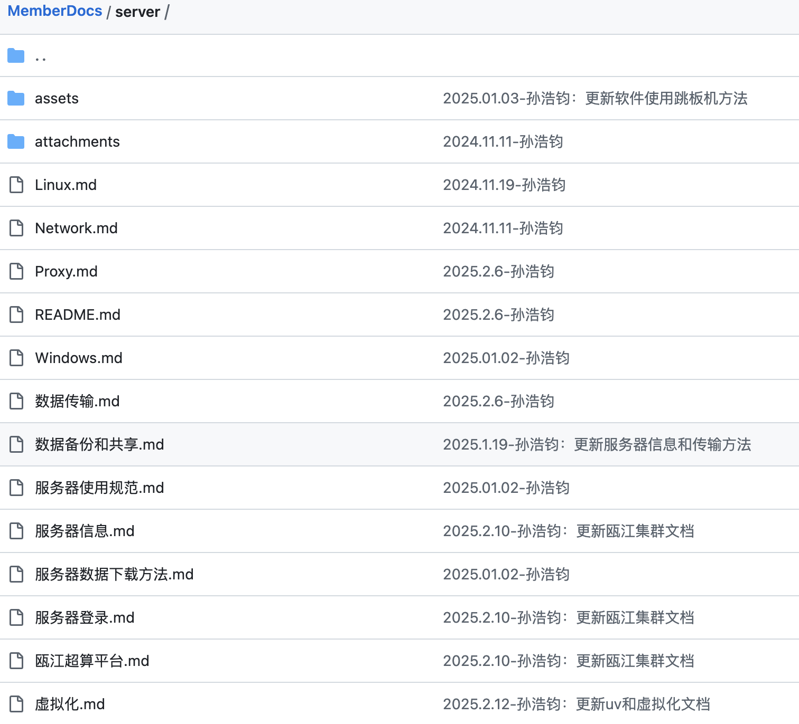

# 配套视频

录制: 项目背景、数据预处理

日期: 2025-02-12 19:52:21

录制文件：<https://meeting.tencent.com/crm/NgWb8VQ6a1>

录制: conda 环境、集群使用、网格搜索

日期: 2025-02-12 20:18:36

录制文件：<https://meeting.tencent.com/crm/Nxg5erPPc6>

录制: 网格搜索、tmux 使用、机器学习

日期: 2025-02-12 20:59:50

录制文件：<https://meeting.tencent.com/crm/2a0L70Wm19>

录制: 数据传输、备份、git 使用、Silconflow的deepseek-api加桌面版chatbox

日期: 2025-02-12 21:40:49

录制文件：<https://meeting.tencent.com/crm/2kWb8X5g59>

# 准备工作

找管理员开若干个节点账号、开堡垒机账号

下载 vscode，然后在插件商店下载Chinese、python、jupyter、ssh 插件

可选插件：vscode-icons，project manager，rainbow csv


如果你没有 conda 环境，自己电脑上下载 Anaconda ，<https://www.anaconda.com/download>，填写邮箱，然后点开邮件里面的连接下载


# 项目背景

脓毒症可能进展为 SIC，SIC 可能进展为 DIC，建模方向有两个，一个是基于脓毒症患者数据去预测 DIC，另一个是基于 SIC 患者数据预测 DIC，二者代码相同，但是临床意义有所不同，两者都做了，结果分别保存在`机器学习结果（脓毒症）.xlsx`和`机器学习结果（sic）.xlsx`，目前主要做的是后者，数据保存在`data`，前者的数据保存在`data/脓毒症患者`

详见 `02-07 工程师例会.pptx`

原始数据如图


# 数据预处理

代码：`data_pre.ipynb`

**数据清洗与缺失值处理**

原始数据集（`data/raw/20250207 null_sic_dic.csv`）包含10441条阴性样本、426条阳性样本，其数据结构特征如下：

-   **非特征字段**：首列为患者ID（`id`）、倒数第二列为现行SIC诊断标准结果（`sic`），均为 1、结局指标（`death`），均不作为模型输入特征

-   **标签定义**：最后一列`dic`为分类标签（0:阴性，1:阳性）

执行分阶段缺失值处理策略：

1.  **特征筛选**：剔除缺失率超过50%的特征变量（本研究中无满足此条件的特征）

2.  **样本筛选**：删除存在5个及以上缺失值的样本（共剔除3347条，保留8960条有效样本）

3.  **缺失值插补**：

    -   *连续性变量*：按标签组别（`dic`分组）计算列均值进行插补

    -   *分类变量*：将缺失值统一编码为"0"，即表示不存在该种情况。\
        清洗后数据保存为`data/清洗后.csv`，其标签分布呈现显著不均衡性（阴性:阳性=8,531:428）。

    最后手动把非特征字段删除，把标签（dic）移动到第一列

#### 数据划分与标准化

**分层数据分割**：\
采用分层抽样策略，按8:2比例将数据集划分为训练集（7,168条）与测试集（1,792条），确保两集合的标签分布与原始数据一致

**特征标准化**：

1.  **Z-score标准化**：对连续型特征进行标准化处理，统一量纲，使得模型能均衡地考虑每个特征。

2.  **步骤**：

    -   基于训练集计算均值与标准差参数

    -   将参数同步应用于测试集标准化，避免数据泄露\
        标准化后数据分别保存为`data/train_data_standardized.csv`与`data/test_data_standardized.csv`。


Z-Score标准化是指:基于原始数据的均值(mean)和标准差(standard deviation)来进行数据的标准化。其主要目的是将不同量级的数据统一化为同一个量级，统一用计算出的Z-Score值衡量，保证了数据间具有可比性。

# conda、代理的使用

代理文档：<https://github.com/ChinaJianNengCloud/MemberDocs/blob/main/server/Proxy.md>

```{shell}
# 查看现有环境
conda info -e #或者：conda env list

# 创建新环境
conda create --name myenv python=3.10 
#创建一个新的名为 myenv 的环境，并安装指定版本的 Python（比如 3.10）。

# 激活环境
conda activate myenv

# 退出当前环境
conda deactivate

# 终端代理：使用 conda 下载包的时候是从国外的网站下载的（如果不指定国内镜像），可能速度会很慢，这个时候要启动终端代理（默认情况下，代理软件不会对终端进行代理，需要手动设置）

# 以节点 10 为例，当前Windows服务器统一使用7897端口，先启动代理软件，比如 clash，然后在终端进行设置
# set http_proxy=http://127.0.0.1:<port>
set http_proxy=http://127.0.0.1:7897
set https_proxy=http://127.0.0.1:7897
set all_proxy=socks5://127.0.0.1:7897
# 关闭终端后代理会失效，每次都要手动设置，或者可以自行编辑 conda 配置文件

# 安装包，可以使用 conda 或者 pip 安装，优先使用 conda
# 注意，你当前激活了哪个 conda 环境，那么包就会安装在哪个环境下
conda install numpy
conda install ipykernel
pip install numpy

# 安装指定版本的包
conda install numpy=1.21

# 查看已安装的包
conda list

# 查看某个包是否已安装
conda list numpy

# 删除包
conda remove numpy

# 删除环境
conda remove -n myenv --all

# 导出环境配置
conda env export > environment.yaml

# 从配置文件创建环境
conda env create -f environment.yaml
```

# 集群（堡垒机、跳板机）使用

ssh 配置文件可参考

会要求输入两次密码，第一次是跳板机的密码，第二次是节点的密码（开账号的时候管理员会告诉，一般为姓名全拼）

```{txt}
Host clks-local-1 # 主机名称，可自定义
  HostName localhost 
  User louhao # 用户名
  Port 7201 # 端口
  ProxyJump tunnel@server.jiannengcloud.com:20222

Host clks-local-2
  HostName localhost
  User louhao
  Port 7202
  ProxyJump tunnel@server.jiannengcloud.com:20222

Host clks-local-3
  HostName localhost
  User louhao
  Port 7203
  ProxyJump tunnel@server.jiannengcloud.com:20222

Host clks-servers-tunnel
  HostName server.jiannengcloud.com
  User tunnel
  Port 20222
  IdentityFile /Users/louhao/Documents/ZeroSutdio/CLKS-Local-Servers-Tunnel.txt #密钥文件路径（可选）

# 跳板机密码：lP890Xs4uf7n1Hu
```

对于 Windows 节点，使用堡垒机：<https://bh.jiannengcloud.com/core/auth/login/>


RDP 为远程桌面，SFTP 为传输文件的时候用的，不要直接上传大文件，看完[服务器数据传输规范](https://github.com/ChinaJianNengCloud/MemberDocs/blob/main/server/%E6%95%B0%E6%8D%AE%E4%BC%A0%E8%BE%93.md)后仍然不知道怎么传，可询问管理员如何传


服务器文档：<https://github.com/ChinaJianNengCloud/MemberDocs/tree/main/server>，建议学习



堡垒机网址：<https://bh.jiannengcloud.com/core/auth/login/>，个人建议使用谷歌浏览器登录（我之前使用 edge，发现很卡，不知道什么原因）

使用节点需要进行登记：<https://github.com/ChinaJianNengCloud/MemberDocs>，也就是服务器集群算力负载登记文档


# 机器学习基础、代码实战

基础知识：

1.  什么是分类、回归问题，什么是特征，什么是标签
2.  训练集、验证集（交叉验证）、测试集
3.  超参数与参数
4.  评估分类器的几个指标：AUC、ACC、F1等，知道混淆矩阵
5.  特征选择（shap 法进行特征重要性评价）
6.  降维方法（PCA、t-SNE、Umap 等），可用于可视化

statquest视频，讲解了一些机器学习知识，可供学习：<https://www.youtube.com/playlist?list=PLblh5JKOoLUICTaGLRoHQDuF_7q2GfuJF>

常用 python机器学习库 scikit-learn文档 ：<https://scikit-learn.org/stable/user_guide.html>

超参数搜索：`grid_search.ipynb`和`grid_search_SMOTENC.ipynb`，后者对训练集进行了过采样（使用 SMOTENC 法）

模型训练：`机器学习实验.ipynb`，这个代码文件是从 十六支队manifei 项目迁移过来的，但是manifei 项目没有进行过采样，所以代码需要进行修改，目前修改了模型选择部分代码并且成功复现，后面的部分（shap、决策边界等），还没有修改，因为还没用到。

# 简单 Linux 命令、tmux使用

准备工作：把 ipynb 导出为 py 文件


目的：创建持久化的终端会话（不会由于 ssh 断开导致运行停止），断开后可重新连接，任务仍然在运行

```{shell}
# 新建tumux会话
tmux new -s my_session
```

```{shell}
# 激活conda环境并运行脚本
conda activate 你的环境名
python 你的脚本.py # 首先要cd到脚本所在的目录
python -W ignore 你的脚本.py # 让警告不显示在终端中，用于避免干扰输出结果，或者可以把输出保存到文件中查看
```

如何终止跑到一半的程序？答：按下 ctrl+c

脱离 tumux 会话：按下 ctrl+B，松开，然后按 D

```{shell}
# 重新连接会话，程序仍然在运行
tmux attach -t my_session
```

如何移动光标查看历史记录：按下 ctrl+B，松开，然后按 \[，即可进入复制模式，按 q 退出，注意要使用英文输入法

```{shell}
# 杀死 session
tmux kill-session -t my_session
```

# 数据组织、数据传输、数据备份

最规范的3级项目保存规范（自己本地、公司集群、github实时用git更新），最好能4级保存，即百度网盘再保存一份。

文档：<https://github.com/ChinaJianNengCloud/MemberDocs/blob/main/server/%E6%95%B0%E6%8D%AE%E4%BC%A0%E8%BE%93.md>

## github 备份

首先在本地（自己电脑）下载 git，<https://git-scm.com/downloads>，记得开启代理下载，不然速度很慢

由于上 GitHub 需要代理，不然速度很慢，git 提交容易失败，所以先给 git 设置代理（注意以后git 提交到远程仓库的时候代理软件要开启）

```{shell}
# 设置代理
git config --global http.proxy "http://127.0.0.1:7890" # 更换为你自己的地址
git config --global https.proxy "http://127.0.0.1:7890"

# 查看代理
git config --global --get http.proxy
git config --global --get https.proxy

# 取消代理设置
git config --global --unset http.proxy
git config --global --unset https.proxy
```

然后在github （<https://github.com/ChinaJianNengCloud>）上面创建远程仓库，点击 new，输入一个英文名称即可，这是一个空的仓库，可以不用创建 README.md，之后自己上传


然后在本地应该也有一个对应的文件夹，存放了项目的代码、数据等，我们把这个文件夹与刚刚创建的远程仓库联系起来

```{shell}
# 首先进入项目所在文件夹
cd /path/to/your/local/repository

git init
```

比如


louhao 代表用户名，SIC 代表当前所在的文件夹，有时候最左边会有（xxx），说明你激活了 conda 的 xxx 环境


```{shelll}
# 添加远程仓库地址，这个地址在新建好仓库后可以看见，直接复制
git remote add origin https://github.com/ChinaJianNengCloud/SIC-DIC.git 

git remote -v  # 查看关联的远程仓库地址
```


```{shell}
# 将修改的文件暂存
git add README.md
```

```{shell}
# 将暂存的代码提交到本地仓库，并且添加提交信息
git commit -m "0212-README.md"
```

```{shell}
# 最后将本地仓库推送到远程存储库上，记得上 GitHub 看看有没有提交成功，要刷新一下
git push -u origin main #-u 表示设置默认上游分支（首次推送时使用）。
```

```{r}
#完成以上步骤后，本地仓库就与远程仓库成功关联了，后续推送代码只需
git push
```

可以使用 vscode 来代替命令行，注意每次 commint 都要写消息


# 其他

## 绘图设置中文字体

```{python}
# python 绘图设置中文字体
from matplotlib import rcParams, font_manager

# windows
plt.rcParams['font.sans-serif'] = ['SimHei']
plt.rcParams['axes.unicode_minus'] = False

# macos
# 指定 PingFang 字体路径
font_path = "/System/Library/Fonts/PingFang.ttc"  # macOS 默认路径
pingfang_font = font_manager.FontProperties(fname=font_path)

# 全局设置字体
rcParams['font.sans-serif'] = pingfang_font.get_name()  # 设置字体
rcParams['axes.unicode_minus'] = False  # 解决负号显示问题
```

```{r}
# R绘图设置中文字体
library(showtext)
showtext_auto()
font_add(family = "Arial", regular = "/Library/Fonts/Arial.ttf")
font_add(family = "STKaiti", regular = "/System/Library/Fonts/STHeiti Medium.ttc")
```

## 资料查询、ai 使用

ai：国内推荐 Deepseek R1， 国外推荐 ChatGPT

资料查询：官方文档，其他人的总结（一般在csdn、知乎等网站可以看到）

## 使用Silconflow的deepseek-api本地使用deepseek-R1

用Silconflow的deepseek-api加桌面版chatbox，指定只用deepseek-R1，教程连接：

<https://blog.csdn.net/qq_55923034/article/details/145471467>

最终效果如下


## 免费教程

医学统计学–中山大学：<https://www.bilibili.com/video/BV1V4411X7Jv/?spm_id_from=333.337.search-card.all.click&vd_source=400ab3e55d83989181fc0b846781b701>

一本免费的在线的python 数据分析手册：<https://wesmckinney.com/book/>，介绍了 numpy、pandas、matplotlib 的使用

一本免费的在线的 python 数据分析手册：<https://jakevdp.github.io/PythonDataScienceHandbook/>，介绍了 numpy、pandas、maploytlib、scikit-learn

一套介绍机器学习基础知识的视频：<https://www.youtube.com/playlist?list=PLblh5JKOoLUICTaGLRoHQDuF_7q2GfuJF>